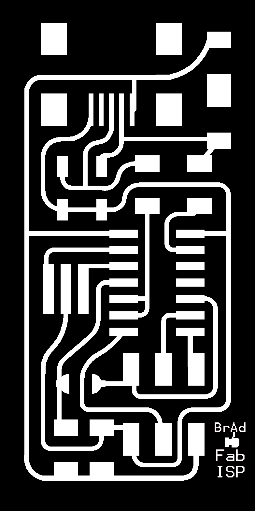
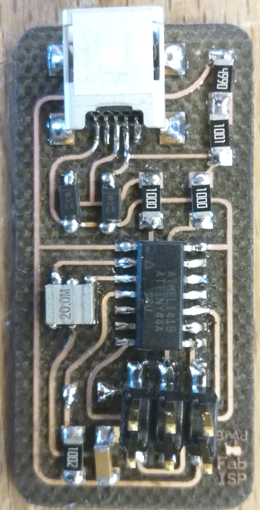
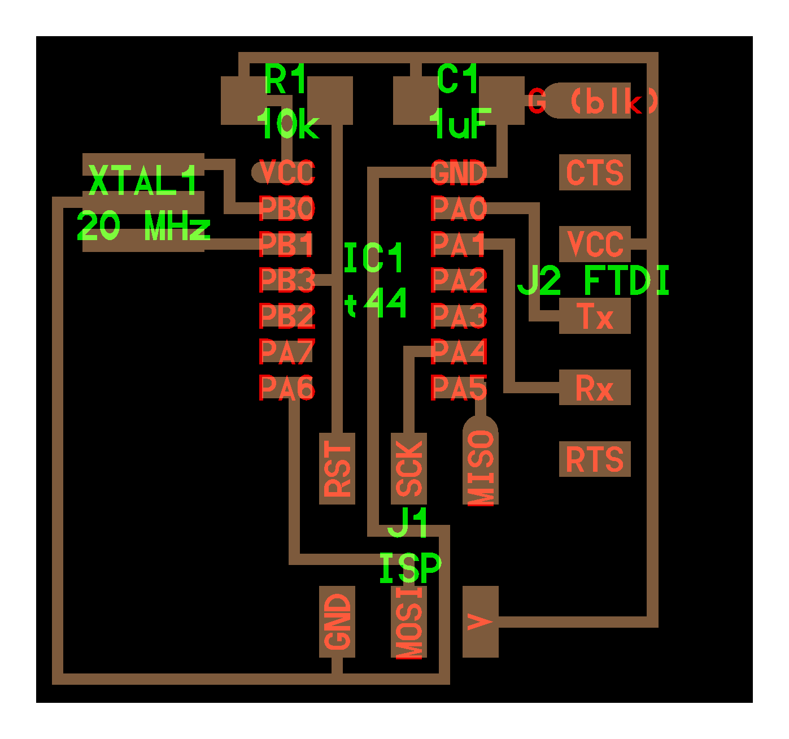

# Fabacademy : *Week -1*

Today is the 9th of january 2018 and I am starting my first day at the fablab Digiscope. Romain Divozzo welcome me into this incredibe space made of cool electronic and incredible machinery.

## I. **FabISP** *in-system-programmer*

### First, try and faile

As a first job, I had to work on the FabISP. An initial PCB that should allow me to programme futur PCB.
> I used this tutorial to fillfull  the board : [**FabISP, a fab-able in-system programmer**](http://fab.cba.mit.edu/content/archive/projects/fabisp/)

| def | pics |
| --- | --- |
| Tadaaa ! But it's a failure... even after install and trying to debug it...  |  |

After different trial and on the advice of my instructor we choose an other board and make it.

I left the outline on the board, thinking it was better this way. But apparently it's not :smile:

### Then succeed

> I choose the second blueprint of this otherone named `Fab Optimus` : [**Demystifying the FabISP and Designing the FabOptimus**](http://fab.cba.mit.edu/classes/863.16/doc/tutorials/FabISP/FabISP_Demystified.html)

**Files :**

Board : [<u>**board**</u>](assets\docs\production\fabISP\FabOptimus2.png), [<u>**component**</u>](production/fabISP/result.jpg), [<u>**trace**</u>](assets\docs\production\fabISP\FabOptimus_Traces2.png)

Files : [<u>**makefile**</u>](assets\docs\production\fabISP\programmFiles\Makefile), [<u>**main.hex**</u>](assets\docs\production\fabISP\programmFiles\main.hex), [<u>**main.c**</u>](assets\docs\production\fabISP\programmFiles\main.c), [<u>**main.elf**</u>](assets\docs\production\fabISP\programmFiles\main.elf), [<u>**main.o**</u>](assets\docs\production\fabISP\programmFiles\main.o)


the second blueprint offer to make this ship replacing the 1,5K resistor by a 1k + 0.5k but on site I didn't found it for now so I used a 499 ohm resistor with 1% margin of error (4,99 ohm) wich is great.

| Shape | CorelDraw Settings | Epilog Settings |
| --- | --- | --- |
| |  |  |
| In corel draw, select your blueprint layer. **Right clic** > <u>*make Haireline*</u>. Select all the white layer and delete them. Group your black layer if needed. | In the object manager you should have two object in the end, configured in `haireline` for the red part, and **filled with color and no outline** |  Print settings for the `Epilog Laser Fusion`. Don't forget to add the thickness of your fabric |
|  |  |


Once you have the Board and download the Makefile programme you need another FabISP already made, link the 2 board by the ISP output and start programming on your linux bash.

```linux
  USB power
  make clean
  make hex
  (sudo) make fuse (check programmer in Makefile, may need to repeat)
  (sudo) make program
  desolder SJ1 and SJ2
  make IDC ISP cable, connecting header pin 1 to pin 1, check wires
```

And normaly if you have done the job right, it should work correctly

> You can now program your own board freely

## II. **Hello-world Card** *echo hello-world*

Files : [<u>**hello.ftdi.44.echo.c**</u>](assets\docs\production\HelloWorldCard\files\hello.ftdi.44.echo.c), [<u>**hello.ftdi.44.echo.c.make**</u>](assets\docs\production\HelloWorldCard\files\hello.ftdi.44.echo.c.make)

| [board](production/HelloWorldCard/hello.ftdi.44.png) | [component]() | [trace](production\HelloWorldCard\hello.ftdi.44.traces.png) |
| --- | --- | --- |
|   |   |   |

For now I made the board and add the principle component. (see engrave pcb with laser cut) I could'nt find the ftdi pin at the moment, so I let it there.
